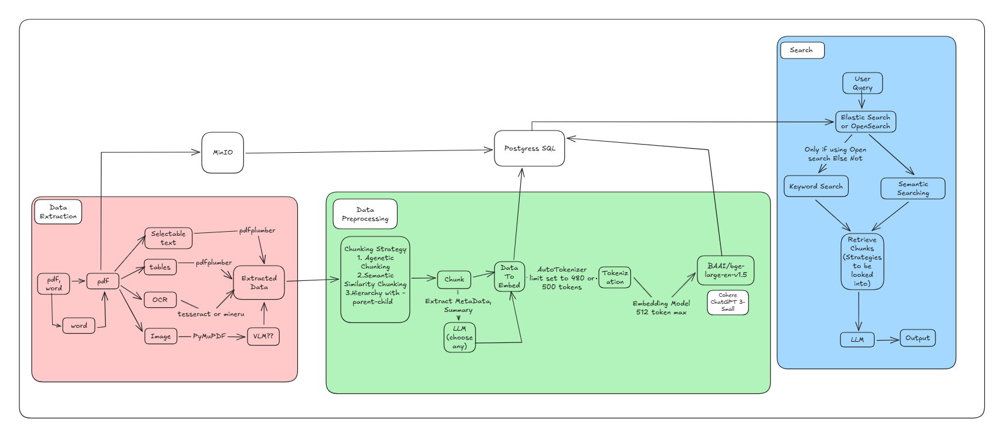

# RAG Pipeline — Intern Project

A document-understanding **Retrieval Augmented Generation (RAG)** system. Upload documents, ask questions, get grounded answers — all backed by a structured, multi-layer pipeline.

---

## What Is This?

This repo contains the architecture design and planning documentation for a RAG system that ingests documents (PDF, Word), extracts and indexes their content, and allows users to query that knowledge using natural language.

The system is designed with a privacy-first, self-hosted philosophy — minimizing external API dependencies and keeping sensitive document data within controlled infrastructure.

---

## Architecture Diagram



---

## Pipeline Overview

The system is divided into three main layers:

```
Document Upload
      |
      v
[1. Data Extraction Layer]
   - Selectable text    (pdfplumber)
   - Tables             (pdfplumber)
   - Scanned pages      (Tesseract OCR)
   - Embedded images    (PyMuPDF)
      |
      v
[2. Preprocessing & Embedding Layer]
   - Chunking           (Semantic / Hierarchical / Agentic)
   - Tokenization       (AutoTokenizer, ~480 tokens)
   - Embedding          (BAAI/bge-large-en-v1.5)
   - Storage            (PostgreSQL metadata + Elasticsearch vectors)
      |
      v
[3. Search & Retrieval Layer]
   - Keyword search     (BM25)
   - Semantic search    (kNN vector similarity)
   - Metadata filtering (by doc, page, tags)
   - LLM answer generation
```

---

## Storage Architecture

| Store | Purpose |
|---|---|
| **MinIO** | Raw file object storage — stores original uploaded documents |
| **PostgreSQL** | Relational metadata store — chunk text, page numbers, file references |
| **Elasticsearch / OpenSearch** | Vector index — stores embeddings and enables semantic + keyword search |

---

## Key Design Decisions

- **Self-hosted by default** — embedding models, search infrastructure, and (in later phases) the LLM run locally
- **Pluggable embedding model** — defaults to `BAAI/bge-large-en-v1.5`, swappable without changing pipeline logic
- **Hybrid retrieval** — BM25 keyword + kNN vector search combined via Reciprocal Rank Fusion (RRF)
- **Async processing** — document ingestion is handled by a Celery task queue, keeping the API non-blocking
- **Reranking** — a cross-encoder reranker (`BAAI/bge-reranker-base`) improves chunk precision before LLM generation

---

## Tech Stack

| Component | Technology |
|---|---|
| API | FastAPI |
| Task Queue | Celery + Redis |
| Object Storage | MinIO |
| Relational DB | PostgreSQL |
| Vector / Search | Elasticsearch 8+ or OpenSearch 2+ |
| PDF Extraction | pdfplumber |
| OCR | Tesseract 5 / Mineru |
| Image Extraction | PyMuPDF |
| Embedding Model | BAAI/bge-large-en-v1.5 (self-hosted) |
| Reranker | BAAI/bge-reranker-base (self-hosted) |
| LLM | Configurable — API (OpenAI / Azure / Anthropic) or self-hosted via Ollama |

---

## Repo Structure

```
intern_project/
├── Docs/
│   └── initial_prompt.md          # Original system design brief and requirements
└── Pipeline_Design/
    ├── rag_pipeline_architecture_v01.png   # Architecture diagram
    └── RAG_Architecture_Analysis.md        # Full technical analysis and implementation plan
```

---

## Implementation Phases

| Phase | Focus |
|---|---|
| **Phase 1** | Core MVP — upload, extract, chunk, embed, query, answer |
| **Phase 2** | Quality — reranking, DOCX support, metadata filtering, query cache |
| **Phase 3** | Advanced — VLM image understanding, self-hosted LLM, observability, multi-tenancy |

For the full breakdown including the pipeline diagram validation, data flow, schema design, and 12-week implementation roadmap, see [`Pipeline_Design/RAG_Architecture_Analysis.md`](Pipeline_Design/RAG_Architecture_Analysis.md).
